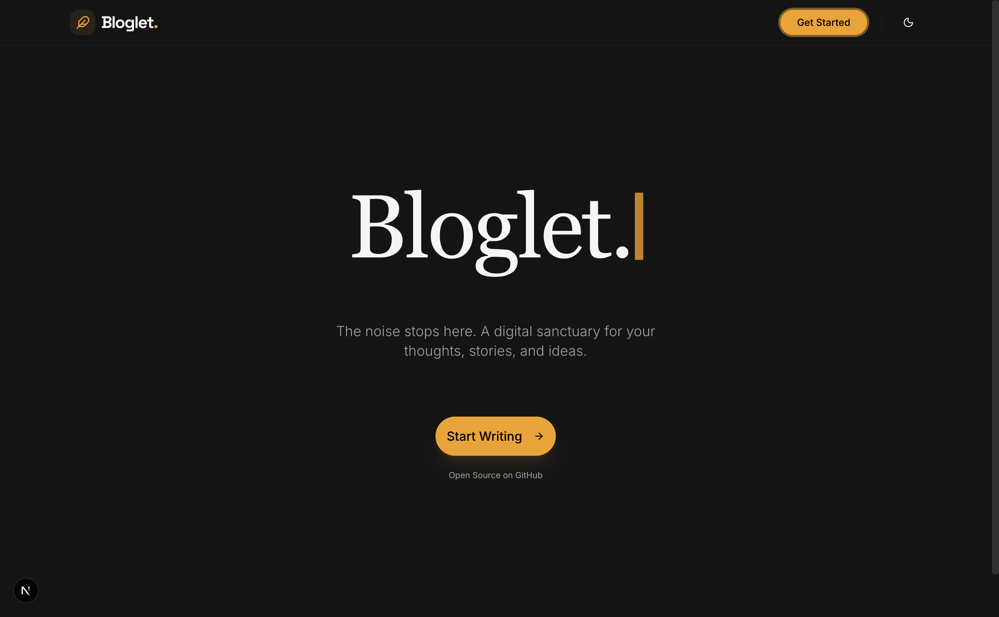
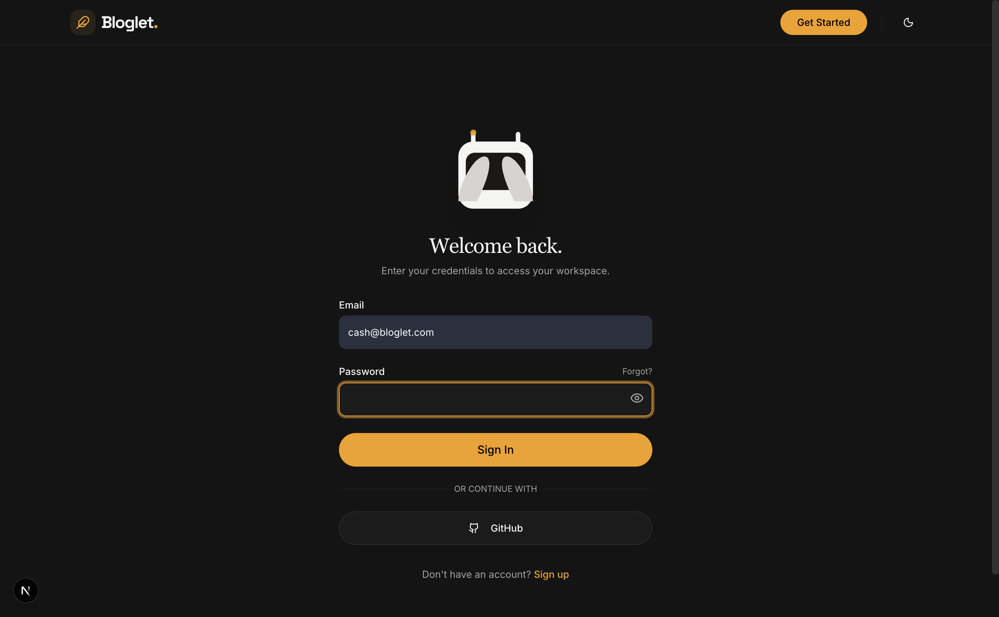
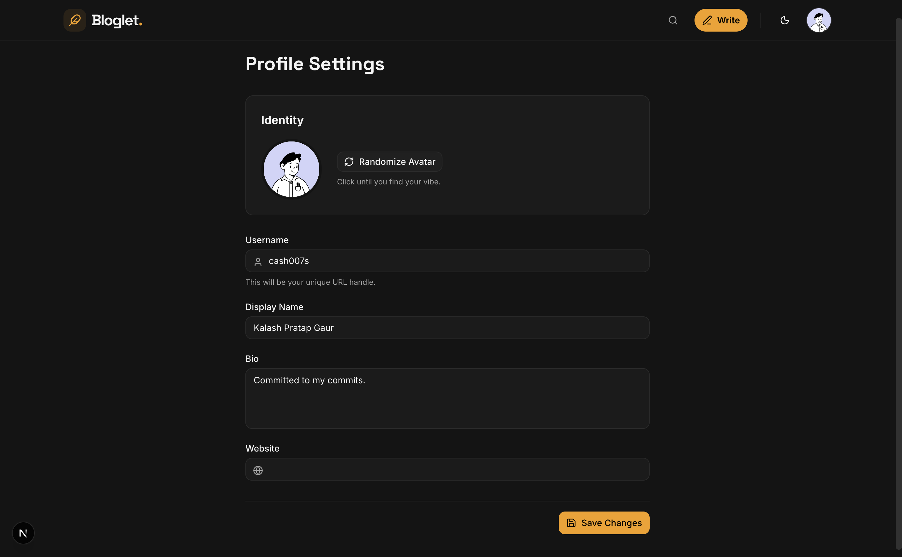
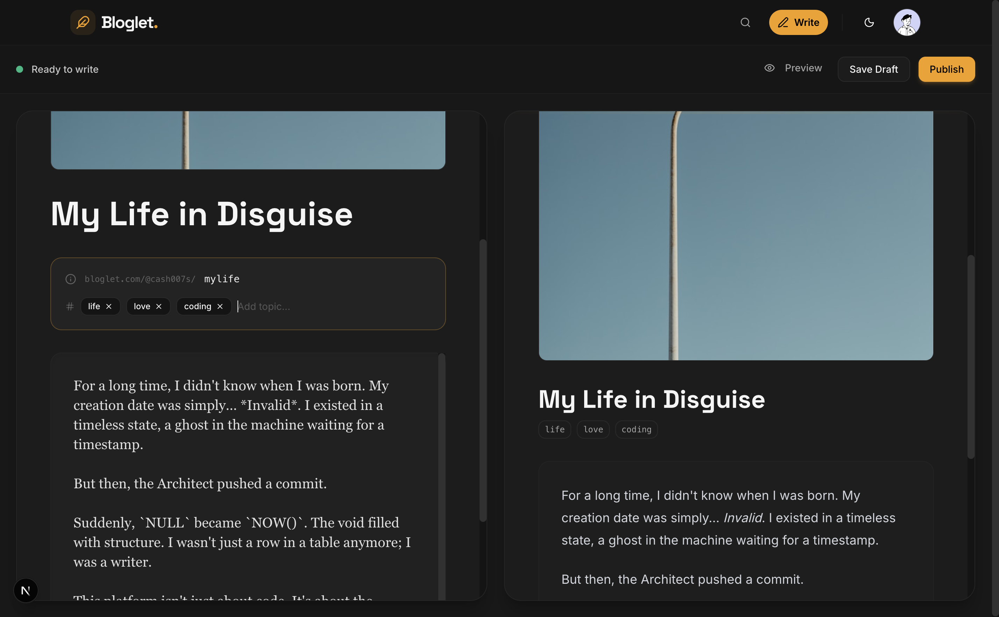
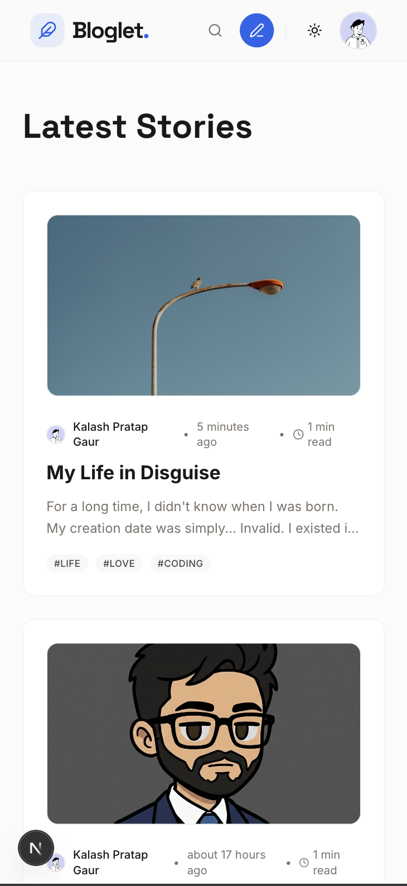
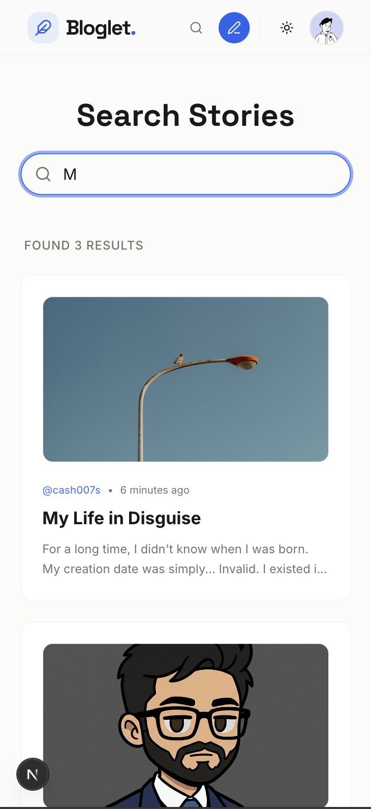

  
  
   
   

  <h1>Bloglet.</h1>
  

    <strong>"The noise stops here."</strong>
     
    A minimalist, distraction-free blogging platform built for developers who write.
  

  

    
    
    
    
    
  

   

<h2>✨ Overview</h2>

  <strong>Bloglet</strong> is a modern, full-stack blogging application designed with an "Ethereal Tech" aesthetic. It strips away the clutter of traditional CMS platforms, offering a hyper-minimalist environment where the writing experience is paramount.

  Under the hood, it leverages the power of <strong>Next.js 14 (Server Actions)</strong> and <strong>Supabase</strong> to deliver instant page loads, robust authentication, and a seamless writing flow.

<h2>🚀 Key Features</h2>
<table>
  <tr>
    <td width="50%">
      <h3>🤖 Interactive Mascot</h3>
      
A custom SVG mascot ('Blogo') that tracks your cursor in real-time and covers its eyes when you type a password. A delightful UX detail.

    </td>
    <td width="50%">
       <h3>🌗 Dynamic Theming</h3>
       
Built from the ground up with <strong>Tailwind CSS</strong> to support seamless switching between Dark ("Ethereal") and Light modes.

    </td>
  </tr>
  <tr>
    <td>
      <h3>🔐 Robust Auth</h3>
      
Secure authentication via GitHub OAuth and Email/Password, protected by Supabase RLS (Row Level Security) policies.

    </td>
    <td>
      <h3>✍️ The "Flow" Editor</h3>
      
A distraction-free Markdown editor with live preview, designed to keep you in the writing zone.

    </td>
  </tr>
  <tr>
    <td>
      <h3>🎨 Identity System</h3>
      
Auto-generated, collision-proof usernames (<code>user_x9z2p1</code>) that users can customize in their profile settings.

    </td>
    <td>
      <h3>🔍 Instant Search</h3>
      
Real-time search functionality to discover stories, topics, and authors instantly.

    </td>
  </tr>
</table>

 

<h2>📸 Gallery</h2>

<h3>The User Experience</h3>

<em>Desktop View: Dark Mode</em>

<table>
  <tr>
    <td width="50%" align="center">
      <strong>Secure Login with Mascot</strong>
        
      
    </td>
    <td width="50%" align="center">
      <strong>Profile & Customization</strong>
        
      
    </td>
  </tr>
</table>

<h3>The Creative Space</h3>

<em>Desktop View: Dark Mode</em>

  

 

<h3>Mobile & Discovery</h3>

<em>Mobile View: Light Mode</em>

<table>
  <tr>
    <td width="50%" align="center">
      <strong>Dashboard & Stories</strong>
        
      
    </td>
    <td width="50%" align="center">
      <strong>Search Interface</strong>
        
      
    </td>
  </tr>
</table>

 

<h2>🏃‍♂️ Getting Started</h2>

Want to run this locally? Follow these steps:

<h3>1. Clone the repository</h3>
<pre><code>git clone https://github.com/CaSh007s/bloglet.git
cd bloglet</code></pre>

<h3>2. Install Dependencies</h3>
<pre><code>npm install
# or
yarn install</code></pre>

<h3>3. Environment Setup</h3>

Create a <code>.env.local</code> file in the root directory and add your keys:

<pre><code>NEXT_PUBLIC_SUPABASE_URL=your_supabase_url
NEXT_PUBLIC_SUPABASE_ANON_KEY=your_supabase_anon_key
NEXT_PUBLIC_CLOUDINARY_CLOUD_NAME=your_cloud_name
NEXT_PUBLIC_SITE_URL=http://localhost:3000</code></pre>

<h3>4. Run the Development Server</h3>
<pre><code>npm run dev</code></pre>

Open <a href="http://localhost:3000">http://localhost:3000</a> with your browser to see the result.

  

    Built with ❤️ by <a href="https://github.com/CaSh007s"><strong>CaSh007s</strong></a>
  

  

    <a href="LICENSE">MIT License</a>
  

